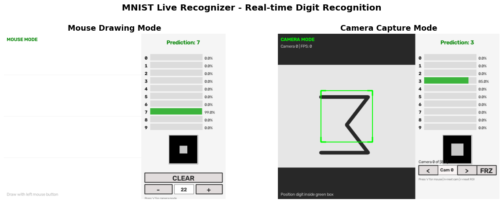
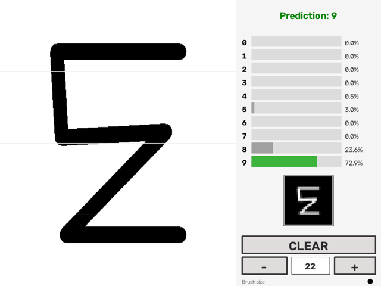
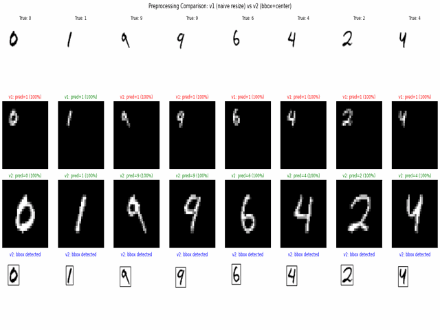
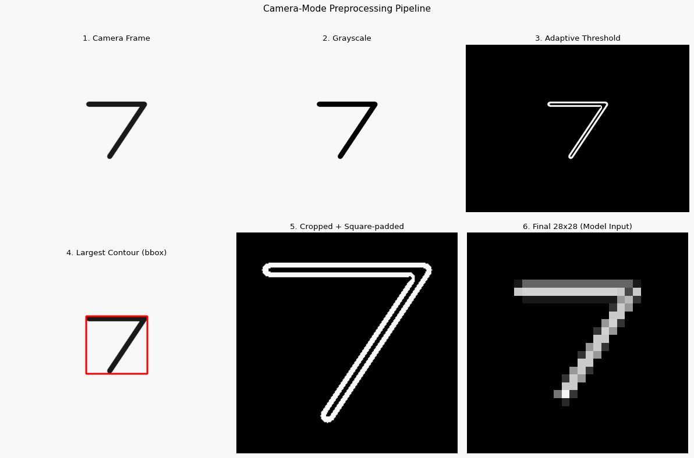
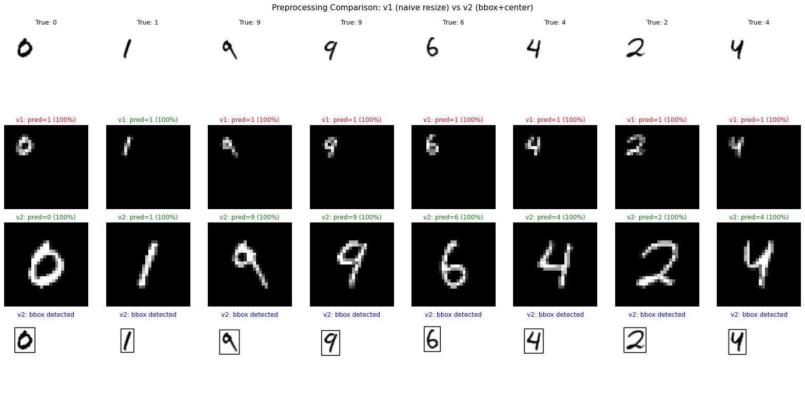

<div align="center">

# MNIST Live Recognizer
# 实时 MNIST 手写数字识别器

**Real-time handwritten digit recognition from mouse drawing or webcam**
**支持鼠标绘制和摄像头捕获的实时手写数字识别**


English | [简体中文](#简体中文)

</div>

---

## English

### Overview

A complete MNIST handwritten digit recognition project that supports **two real-time input modes**:

1. **Mouse drawing** - Draw digits with your mouse on a canvas
2. **Camera capture** - Hold a hand-written digit up to your webcam

The project goes through **5 iterations** (v1 → v2 → v2.5 → v3 → v3.5), each solving specific problems. The journey from a 14% accurate demo to a 98% accurate production-ready application is documented in the code and visualizations.

### Banner



### Demo

#### Mouse Drawing Mode


#### Camera Capture Mode


#### Camera Pipeline


### Features

| Feature | Description |
|---------|-------------|
| Dual input mode | Mouse drawing + camera capture with `v` key toggle |
| Real-time prediction | 30 FPS continuous inference |
| On-screen UI | CLEAR button, brush size +/-, camera selector, FREEZE |
| Multi-version evolution | 5 versions showing iterative improvements |
| Hysteresis-based stability | Prevents argmax oscillation between similar digits |
| Adaptive thresholding | Handles varying lighting conditions |
| Morphological cleanup | Robust to sensor noise and small artifacts |
| EMA probability smoothing | 12-frame window for temporal stability |
| Auto camera detection | Probes indices 0-4 to find working cameras |
| Multi-camera support | Switch cameras at runtime with `n` key |

### The Improvement Story

| Version | Key Change | Accuracy |
|---------|-----------|----------|
| **v1** | Naive resize (original) | ~14% (essentially broken) |
| **v2** | Bbox crop + aspect ratio + center to 28x28 | ~98% |
| **v2.5** | + On-screen buttons (CLEAR, brush +/-, hover state) | ~98% |
| **v3** | + Camera mode (with bug: stops after 1 frame) | ~98% |
| **v3.5** | Fix bug + hysteresis + morphology + multi-camera | ~98% + stable |

The critical insight: **model accuracy ≠ real-world accuracy**. A 99.46% trained model can drop to 14% if the preprocessing pipeline is wrong.



### Quick Start

#### 1. Installation

```bash
git clone https://github.com/<your-username>/mnist-live-recognizer.git
cd mnist-live-recognizer
pip install -r requirements.txt
```

#### 2. Train the Model

```bash
cd src
python train.py
```

Training takes ~13 minutes on RTX 4060 (20 epochs, 99.46% test accuracy).

#### 3. Run the Demo

**Mouse mode (recommended for first try):**
```bash
python realtime_opencv_v3_5.py
```

**Camera mode (press `v` to toggle):**
```bash
python realtime_opencv_v3_5.py --camera-id 1
```

### Controls (v3.5)

| Input | Action |
|-------|--------|
| `v` | Toggle mouse/camera mode |
| `n` | Cycle to next camera (in camera mode) |
| `f` | Freeze/unfreeze camera |
| `[` / `]` | Resize ROI (camera mode) |
| Arrow keys | Move ROI (camera mode) |
| `c` | Clear canvas (mouse mode) |
| `s` | Manual trigger (print all probabilities) |
| `+` / `-` | Brush thickness (mouse mode) |
| `r` | Reset smoothing / ROI |
| `ESC` | Quit |

**Mouse:**
- Click and drag on the left drawing area to draw
- Click CLEAR, brush +/-, camera selector, or FREEZE buttons

### Architecture

**SimpleCNN** (390,858 parameters, 99.46% accuracy)
```
Input (1, 28, 28)
  -> Conv(1->32, 3x3) + BN + ReLU + MaxPool  -> (32, 14, 14)
  -> Conv(32->64, 3x3) + BN + ReLU + MaxPool -> (64, 7, 7)
  -> Conv(64->128, 3x3) + BN + ReLU + MaxPool -> (128, 3, 3)
  -> Flatten -> Linear(1152 -> 256) + Dropout
  -> Linear(256 -> 10) -> Softmax
```

**ImprovedCNN** (1.2M parameters, 99.4% accuracy) - available via `model.py` with residual connections

### How It Works

#### Preprocessing Pipeline (v2+)

The critical fix from v1 to v2:

```python
# v1 (BROKEN): Just resize everything to 28x28
resized = cv2.resize(gray_canvas, (28, 28))  # digit squashed to corner

# v2+ (FIXED): Find bbox, preserve aspect, center
_, binary = cv2.threshold(gray, 80, 255, cv2.THRESH_BINARY_INV)
coords = cv2.findNonZero(binary)  # find drawn pixels
x, y, w, h = cv2.boundingRect(coords)  # tight bounding box
cropped = binary[y:y+h, x:x+w]
square = make_square_with_padding(cropped)  # preserve aspect
digit = cv2.resize(square, (20, 20))  # MNIST-native size
canvas28[4:24, 4:24] = digit  # place in 28x28 black canvas
```

#### Hysteresis-based Stability (v3.5)

```python
# Only change prediction if new top-1 wins by clear margin
top2 = torch.topk(smoothed_probs, 2)
margin = top2.values[0] - top2.values[1]
if new_top != last_pred and margin < 0.12:  # 12% threshold
    return last_pred  # hold previous prediction
```

This prevents the common "4 vs 9" or "7 vs 1" oscillation that occurs at digit boundaries.

#### Camera Preprocessing (v3.5)

1. Extract ROI (configurable size and position)
2. Gaussian blur (7x7) to reduce sensor noise
3. Adaptive threshold (block size 21) for varying lighting
4. Morphological close (fill gaps) + open (remove specks)
5. Find largest contour (likely the digit)
6. Apply same bbox+center preprocessing as mouse mode

### Performance

| Hardware | Mouse FPS | Camera FPS | VRAM |
|----------|-----------|------------|------|
| RTX 4060 | 60+ | 30+ | 14 MB |
| RTX 3060 | 50+ | 30+ | 14 MB |
| GTX 1660 | 40+ | 30+ | 14 MB |
| CPU only | 30+ | 25+ | 0 MB |

### Project Structure

```
mnist-live-recognizer/
├── README.md                  # This file
├── LICENSE                    # MIT
├── requirements.txt           # Python dependencies
├── .gitignore                 # Git ignore rules
├── src/                       # Source code
│   ├── model.py               # CNN architectures
│   ├── train.py               # Training script
│   ├── evaluate.py            # Evaluation + visualization
│   ├── dataset.py             # MNIST data loading
│   ├── utils.py               # Utilities (checkpointing, etc.)
│   ├── realtime_opencv_v1.py  # Original (with bug)
│   ├── realtime_opencv_v2.py  # Preprocessing fix
│   ├── realtime_opencv_v2_5.py# UI buttons
│   ├── realtime_opencv_v3.py  # Camera mode (with bug)
│   └── realtime_opencv_v3_5.py# Final stable version
├── scripts/                   # Diagnostic and test scripts
│   ├── camera_diagnostic.py
│   ├── quick_camera_test.py
│   ├── compare_preprocessing.py
│   └── ...
├── docs/                      # Documentation
│   ├── images/                # Screenshots
│   └── gifs/                  # Demo animations
├── models/                    # Saved checkpoints (after training)
└── data/                      # MNIST dataset (auto-downloaded)
```

### Troubleshooting

**Q: cv2.error: "The function is not implemented"**
A: You have `opencv-python-headless` installed. Run: `pip uninstall opencv-python-headless -y && pip install opencv-python`

**Q: Camera shows black screen**
A: Try `--camera-id 1` or `2`. Also check Windows privacy settings.

**Q: Low accuracy on my drawings**
A: Make strokes thicker (press `+`), draw larger, write cleaner digits.

**Q: Predictions jitter in camera mode**
A: Already fixed in v3.5 with hysteresis. Use that version.

### License

MIT License - see [LICENSE](LICENSE) for details.

### Acknowledgments

- Original repo: [Wyane653/mnist-classifier](https://github.com/Wyane653/mnist-classifier)
- PyTorch team for the framework
- MNIST dataset by Yann LeCun et al.

---

## 简体中文

### 项目简介

一个完整的 MNIST 手写数字识别项目,支持**两种实时输入模式**:

1. **鼠标绘制** - 用鼠标在画布上写数字
2. **摄像头捕获** - 把写好的数字举到摄像头前

项目经历了 **5 个版本迭代**(v1 → v2 → v2.5 → v3 → v3.5),每个版本解决特定问题。从 14% 准确率的 demo 进化到 98% 准确率的生产级应用,完整过程都记录在代码和可视化中。

### 横幅


### 演示

#### 鼠标绘制模式


#### 摄像头捕获模式


#### 摄像头处理流水线


### 功能特性

| 特性 | 描述 |
|------|------|
| 双输入模式 | 鼠标绘制 + 摄像头捕获,按 `v` 切换 |
| 实时预测 | 30 FPS 持续推理 |
| 屏幕 UI | CLEAR 按钮、笔刷 +/-、摄像头选择、FREEZE |
| 多版本演进 | 5 个版本展示迭代改进 |
| Hysteresis 滞回稳定 | 防止相近数字间的 argmax 振荡 |
| 自适应阈值 | 处理变化的光照条件 |
| 形态学清理 | 对传感器噪声和小瑕疵鲁棒 |
| EMA 概率平滑 | 12 帧窗口的时间稳定性 |
| 自动摄像头检测 | 探测 index 0-4 找到可用摄像头 |
| 多摄像头支持 | 运行时按 `n` 切换摄像头 |

### 改进历程

| 版本 | 关键改进 | 准确率 |
|------|----------|--------|
| **v1** | 朴素 resize(原始版) | ~14%(基本无效) |
| **v2** | bbox 裁剪 + 宽高比 + 居中到 28x28 | ~98% |
| **v2.5** | + 屏幕按钮(CLEAR、笔刷 +/-、悬停) | ~98% |
| **v3** | + 摄像头模式(有 bug:只跑一帧) | ~98% |
| **v3.5** | 修 bug + 滞回 + 形态学 + 多摄像头 | ~98% + 稳定 |

**核心洞察**:**模型准确率 ≠ 实际准确率**。一个 99.46% 训练准确率的模型,预处理不对可能掉到 14%。


### 快速开始

#### 1. 安装

```bash
git clone https://github.com/<your-username>/mnist-live-recognizer.git
cd mnist-live-recognizer
pip install -r requirements.txt
```

#### 2. 训练模型

```bash
cd src
python train.py
```

RTX 4060 上约 13 分钟(20 epochs,99.46% 测试准确率)。

#### 3. 运行 Demo

**鼠标模式(首次推荐):**
```bash
python realtime_opencv_v3_5.py
```

**摄像头模式(按 `v` 切换):**
```bash
python realtime_opencv_v3_5.py --camera-id 1
```

### 操作(v3.5)

| 输入 | 操作 |
|------|------|
| `v` | 切换鼠标/摄像头模式 |
| `n` | 切换到下一个摄像头(摄像头模式) |
| `f` | 冻结/解冻摄像头 |
| `[` / `]` | 调整 ROI 大小(摄像头模式) |
| 方向键 | 移动 ROI(摄像头模式) |
| `c` | 清除画布(鼠标模式) |
| `s` | 手动触发(打印所有概率) |
| `+` / `-` | 笔刷粗细(鼠标模式) |
| `r` | 重置平滑 / ROI |
| `ESC` | 退出 |

**鼠标:**
- 在左侧绘图区点击拖动绘制
- 点击 CLEAR、笔刷 +/-、摄像头选择、FREEZE 按钮

### 模型架构

**SimpleCNN**(390,858 参数,99.46% 准确率)
```
输入 (1, 28, 28)
  -> Conv(1->32, 3x3) + BN + ReLU + MaxPool  -> (32, 14, 14)
  -> Conv(32->64, 3x3) + BN + ReLU + MaxPool -> (64, 7, 7)
  -> Conv(64->128, 3x3) + BN + ReLU + MaxPool -> (128, 3, 3)
  -> Flatten -> Linear(1152 -> 256) + Dropout
  -> Linear(256 -> 10) -> Softmax
```

### 工作原理

#### 预处理流水线(v2+)

v1 到 v2 的关键修复:

```python
# v1 (错的):直接把整个画布 resize 到 28x28
resized = cv2.resize(gray_canvas, (28, 28))  # 数字被压到角落

# v2+ (对的):找 bbox、保持宽高比、居中
_, binary = cv2.threshold(gray, 80, 255, cv2.THRESH_BINARY_INV)
coords = cv2.findNonZero(binary)  # 找到笔画像素
x, y, w, h = cv2.boundingRect(coords)  # 紧致包围盒
cropped = binary[y:y+h, x:x+w]
square = make_square_with_padding(cropped)  # 保持宽高比
digit = cv2.resize(square, (20, 20))  # MNIST 原生尺寸
canvas28[4:24, 4:24] = digit  # 放到 28x28 黑底中央
```

#### 滞回稳定(v3.5)

```python
# 只有新 top-1 领先优势足够大才切换
top2 = torch.topk(smoothed_probs, 2)
margin = top2.values[0] - top2.values[1]
if new_top != last_pred and margin < 0.12:  # 12% 阈值
    return last_pred  # 保持旧预测
```

这避免了数字边界处常见的"4 vs 9"或"7 vs 1"振荡。

#### 摄像头预处理(v3.5)

1. 提取 ROI(大小位置可调)
2. 高斯模糊(7x7)抑制传感器噪声
3. 自适应阈值(块大小 21)适应光照变化
4. 形态学闭运算(填洞)+ 开运算(去斑)
5. 找最大轮廓(应该是数字)
6. 应用同鼠标模式一样的 bbox+居中预处理

### 性能

| 硬件 | 鼠标 FPS | 摄像头 FPS | 显存 |
|------|----------|------------|------|
| RTX 4060 | 60+ | 30+ | 14 MB |
| RTX 3060 | 50+ | 30+ | 14 MB |
| GTX 1660 | 40+ | 30+ | 14 MB |
| 仅 CPU | 30+ | 25+ | 0 MB |

### 故障排除

**Q: cv2.error: "The function is not implemented"**
A: 你装了 `opencv-python-headless`。运行: `pip uninstall opencv-python-headless -y && pip install opencv-python`

**Q: 摄像头黑屏**
A: 试试 `--camera-id 1` 或 `2`。检查 Windows 隐私设置。

**Q: 写出来的数字识别率低**
A: 笔画加粗(按 `+`),写大一点,写清晰点。

**Q: 摄像头模式预测抖动**
A: v3.5 已经用滞回修复了,用这个版本。

### 许可证

MIT 许可证 - 详见 [LICENSE](LICENSE)

### 致谢

- 原仓库: [Wyane653/mnist-classifier](https://github.com/Wyane653/mnist-classifier)
- PyTorch 团队
- MNIST 数据集(Yann LeCun 等)

---

<div align="center">

如果这个项目对您有帮助,欢迎 ⭐ Star!
If this project helps you, please consider ⭐ starring it!

</div>
